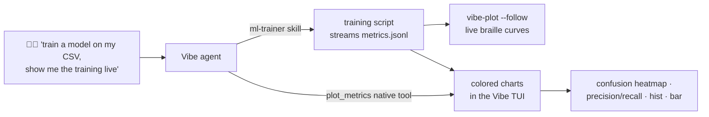

# Vibe Pulse

**Live ML training and data visualization in the terminal — built for [Mistral Vibe](https://github.com/mistralai/vibe).**

Vibe Work (web) can chart your data in Canvas. Vibe Code (CLI) — and every other
terminal coding agent — cannot. Data scientists who live in the terminal still
have to context-switch to Jupyter or TensorBoard just to see whether a training
run converges. Vibe Pulse closes that gap.

> **Upstream:** the core capability is proposed to the Vibe CLI itself —
> [mistralai/mistral-vibe#920](https://github.com/mistralai/mistral-vibe/pull/920)
> (draft), built on `render_braille`, the primitive that animates Vibe's mascot.



## Components

- **`vibe-plot`** — a zero-config terminal plotter. Reads JSON lines or CSV,
  renders Unicode/braille line & scatter charts (live with `--follow`),
  histograms (`--hist`), bar charts (`--bar`, via plotext), ANSI heatmaps
  (`--heatmap`), and per-class precision/recall bars (`--report`). Works in
  any Unicode terminal; no GUI, no notebook, no browser.
- **`plot_metrics` native Vibe tool** — a first-class `BaseTool` implementation
  ([vibe_tools/plot_metrics.py](vibe_tools/plot_metrics.py)) loaded through
  Vibe's own tool discovery (`tool_paths`), rendering charts directly in the
  Vibe conversation. Drop-in compatible with `vibe/core/tools/builtins/` —
  PR-ready for upstream.
- **`ml-trainer` skill** — teaches Vibe the whole loop: inspect a dataset,
  generate a training script that streams metrics, attach the live plot, then
  render the final report.
- **`telemetry` hook** ([.vibe/hooks.toml](.vibe/hooks.toml)) — a `post_tool`
  hook logs every tool call (latency, status, output size) to
  `runs/telemetry.jsonl`… which vibe-plot can follow live: the agent charts
  its own telemetry.
  `uv run vibe-plot runs/telemetry.jsonl --follow --x call --y duration_ms`
- **`examples/train_digits.py`** — reference training script (sklearn digits,
  trains in seconds) that emits the metrics stream and final artifacts.
- **`examples/train_weather.py`** — the same workflow on real data: trains a
  PyTorch forecaster on 3.5 years of Paris temperatures (Open-Meteo) and
  predicts tomorrow's max — live curves, predicted-vs-actual overlay, and a
  topical answer during the July 2026 heatwave.

## Quickstart

```bash
uv sync

# terminal 1 — train (or let Vibe do it via the ml-trainer skill)
uv run python examples/train_digits.py --epochs 40

# terminal 2 — watch it live
uv run vibe-plot runs/digits/metrics.jsonl --follow --idle-timeout 5 --title "MLP on digits"

# after training
uv run vibe-plot runs/digits/confusion.json --heatmap
uv run vibe-plot runs/digits/report.json --report

# it is also a generic terminal data-viz tool — e.g. the July 2026 heatwave:
uv run vibe-plot data/paris_temps.csv --x day --y tmax,tmin --title "Paris temps (°C)"
uv run vibe-plot data/france_tmax_7d.csv --bar --x city --y tmax --title "Heatwave (7-day max)"
uv run vibe-plot data/paris_temps.csv --hist tmax --title "distribution of daily max temp"
```

## Terminal-native MLOps (W&B-style, no server)

- **Run tracking** — every training run appends config + final metrics to
  `runs/index.jsonl`; each run keeps its own `metrics.jsonl` stream.
- **Run comparison** — overlay any metric across experiments:
  `uv run vibe-plot runs/a/metrics.jsonl runs/b/metrics.jsonl --compare --y loss`
- **Agent-driven sweeps** — no sweep server needed: ask Vibe to "try 3 learning
  rates and compare" and the skill orchestrates train → track → compare.
- **On-device validation** — `examples/train_digits_torch.py` compiles and
  profiles the trained model on a real Snapdragon via Qualcomm AI Hub
  (`uv sync --extra aihub`). Measured on a real device during the hackathon:
  **0.052 ms inference, 24 MB peak memory on a Samsung Galaxy S24+**.
- **Vibe on Qualcomm silicon** — a `[[providers]]` block points the CLI at
  Llama-3.1-8B served on Qualcomm Cloud AI 100 (Cirrascale AI Suite):
  `VIBE_ACTIVE_MODEL=qualcomm vibe`.

## Roadmap

Built on the shoulders of the terminal-dataviz ecosystem — next integrations:

- [textual-plotext](https://github.com/Textualize/textual-plotext): render charts
  as real Textual widgets inside Vibe's TUI (Vibe is Textual-based — this is its
  own ecosystem's official plotting widget).
- [rich-pixels](https://github.com/Textualize/rich-pixels): show misclassified
  samples (e.g. digit images) right in the conversation.
- [textual-plot](https://github.com/davidfokkema/textual-plot): zoom/pan for
  interactive exploration.
- plotext datetime axes, candlesticks, multi-panel dashboards.
- Heavier training loops: PyTorch models on real datasets, with on-device
  validation via Qualcomm AI Hub (compile + profile on Snapdragon).
- Full terminal data-analysis workflows: dataset profiling, correlations,
  drift monitoring — the terminal as a first-class data science surface.

## Use it from Mistral Vibe

Add the skill and the native tool to `~/.vibe/config.toml`:

```toml
skill_paths = ["/path/to/vibe_pulse/skills"]
tool_paths  = ["/path/to/vibe_pulse/vibe_tools"]
```

Then ask Vibe: *"train a model on the digits dataset and show me the training
live"*.

---

Built at the Mistral AI Vibe Hackathon — Paris, July 18, 2026.
